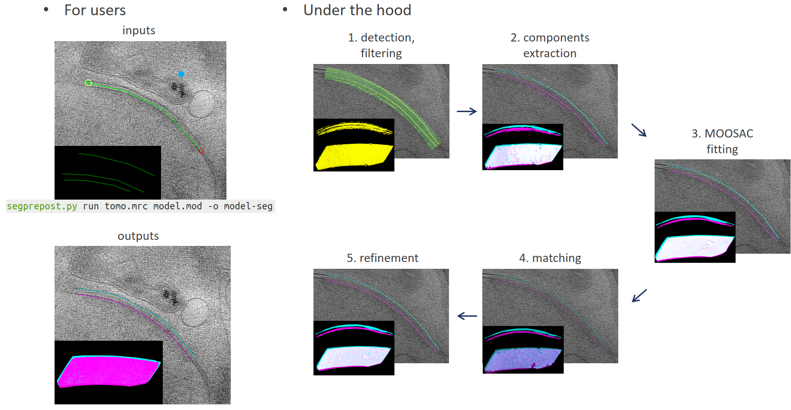

# Readme

## Introduction

A python package for the segmentation of pre- and post-synaptic membranes for electron tomography. The algorithm combines tensor voting [1] with flexible surface fitting tailored to synaptic membranes. Aims for high quality segmentation from low SNR tomogrphies with only a few user inputs.

[1] Martinez-Sanchez et al. "Robust membrane detection based on tensor voting for electron tomography" *Journal of Structural Biology 2014* [url](https://www.sciencedirect.com/science/article/pii/S1047847714000495)

## Installation

This package does not support pip yet, so you need to install it manually.

Clone this repo into a path which can be recognized by your python.

Create a virtual environment (e.g. conda). Install dependencies: numpy, scipy>1.6, pandas, scikit-learn, scikit-image, tslearn, deap, igraph, matplotlib, napari, mrcfile, starfile, h5py, splipy, open3d>0.15.

(On SIAT-ICBI HPC, the above steps can be done by adding `/share/root/user/liaozh/modulefiles` to `$MODULEPATH` in `~/.bashrc`.)

## Usage

### Membrane segmentation



#### Step 1: manual region selection

Manually select the synaptic region for segmentation. Draw guiding lines as below, then a region centered around the line would be selected.

Open tomo_file in IMOD 3dmod.

Create object 1: draw a guiding line by point-clicking along the synaptic cleft.

Create object 2: a point in the presynaptic region.

Save as a model file.

Alternatives: run `segdrawmodel.sh *.mrc` to draw on tomos one by one.

#### Step 2: segmentation

Run commands in terminal:
```
segprepost.py run <tomo_file> <model_file> -o <outputs> -px <pixel_size_in_nm> --extend <extend_width_in_nm>
```

Parameters:
- tomo_file: Name of the tomo file (.mrc).
- model_file: Name of the IMOD model file (.mod). It can be omitted if it has the same name as tomo_file but with suffix replaced by '.mod'
- pixel_size: Pixel size in nm. It can be omitted if it is contained in the header of tomo_file.
- outputs: Name of the output files, without the file extensions. It can be omitted, then it will be set to model_file with '.mod' replaced by '-seg'.
- extend: The selected region would be an extension of the guiding line by this distance (in nm) on both sides. Default is 30 (nm).

Alternatives: run `segsbatchtemplate.sh` to generate a sbatch file for job submission.

Outputs: (1 for presynapse, 2 for postsynapse)
- name-seg.npz: Info of all steps and results. Results can be retrieved in python using: `numpy.load(name-seg.npz, allow_pickle=True)["results"].item()`.
- name-seg.png: Images of sample slices.
- name-seg.mod: An IMOD model file with segmented membranes and the manual bounding region.

Visualization:
run `segview.py args/steps/3d/moosac state.npz`

### Toolbox

segdrawmodel.sh: open mrc one by one for drawing models.

segsbatchtemplate.sh: generate a template sbatch file.

segonemem.py: segmemtation of one membrane.

segview.py: visualize segmentation results using napari.

segmembrano.py: generate membranograms from segmentation.

segsampling.py: weighted sampling + classification on segmentation.

segsampling2.py: weighted sampling on segmentation.

### Diagnosis

If the segmentation is unsatisfactory, try refining the manual labeling. Draw a finer guiding line along the middle of the synaptic cleft. Run `segprepost.py runfine <tomo_file> <model_file> --extend <extension_in_nm>` with a smaller extension, such that the selected region is more targeted.

If two membranes are wrongly divided, try manually provide clues. Draw the guiding lines such that they can separate pre-membrane from post-membrane. Run `segprepost.py runfine <tomo_file> <model_file> --extend <extension_in_nm>`. Then the segmentation would be done individually for the two regions separated by the guiding lines.

## Changelog

v1.2.0: Enriched seg_file. Added version,tomo_file,pixel_nm to results.

v1.2.1: Reduced the size of seg_file from outputs of segbase,segprepost,segonemem. (Removed attribute tomo after detect. Reload/specify when needed.)

v1.3.0: Added segsampling.py for density-based sampling on the segmentation.

v1.3.1: Added segsampling2.py (localmax only).

v1.3.2: Added segsampling3.py (uniform, but has bugs).

v1.3.3: Modified segdrawmodel.sh.

v1.3.4: Added segsampling4.py (uniform, but may be slow).

v1.3.5: Dealt with interpolation bounds error in memsampling.py.

v1.3.6: Updated readme.md.
